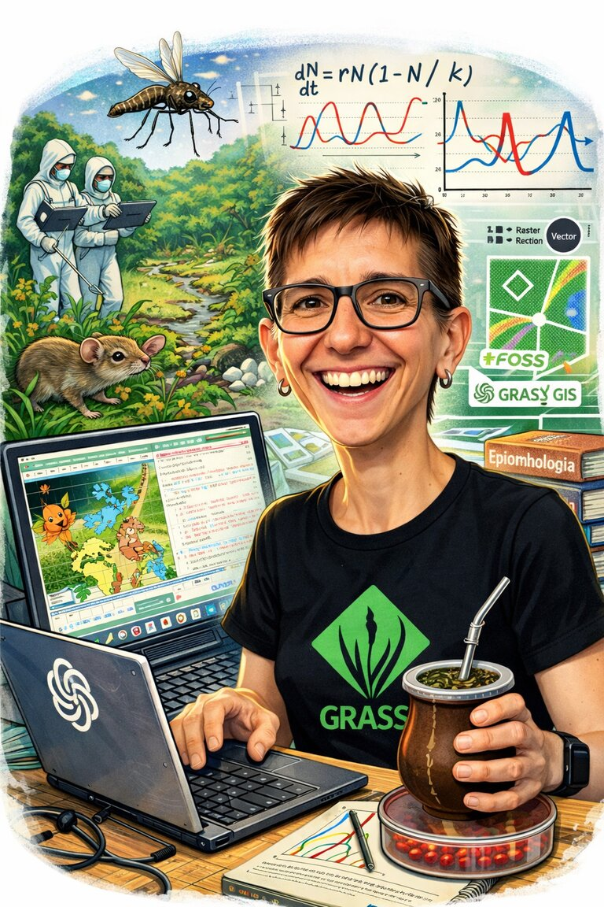
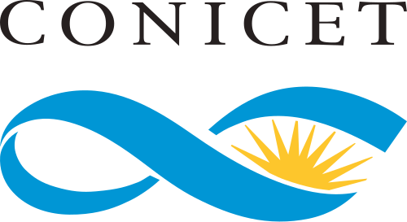
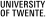

::: {#hero .hero-split}

::: {.hero-side}
```{=html}

```

::: {.hero-links}
[](https://scholar.google.com/citations?user=zoN4MO4AAAAJ&hl=en){.about-link aria-label="Google Scholar" title="Google Scholar"}
[](https://orcid.org/0000-0002-4633-2161){.about-link aria-label="ORCID" title="ORCID"}
[](https://www.researchgate.net/profile/Veronica_Andreo2){.about-link aria-label="ResearchGate" title="ResearchGate"}
[<i class="fa-brands fa-github"></i>](https://github.com/veroandreo){.about-link aria-label="GitHub" title="GitHub"}
[<i class="fa-solid fa-envelope"></i>](mailto:veronica.andreo@ig.edu.ar){.about-link aria-label="Email" title="Email"}
:::
:::

::: {.hero-main}
::: {.hero-role}
Researcher & Lecturer
:::

```{=html}
<h1 class="hero-name">Verónica Andreo</h1>
```

::: {.hero-affiliation}
[CONICET](https://www.conicet.gov.ar/) · [Instituto Gulich](http://ig.conae.unc.edu.ar/) - [CONAE](https://www.argentina.gob.ar/ciencia/conae)/[UNC](https://www.unc.edu.ar/)
:::

My research asks a simple question with a difficult answer: **where and when do
environmental conditions converge to make a disease outbreak likely?** I look for
the answer in satellite data — and in the ecology of the species that carry 
the pathogens.

I am a biologist, and I work with **Earth observation in all its forms** — optical,
thermal and radar imagery, dense satellite time series, and the environmental
indicators built from them — combining it with **spatio-temporal statistics and
machine learning** to model where species live, how their populations shift through
the year, and how that turns into **forecasts and risk maps**, early enough for them
to be useful.

That work runs on open source tools, and part of my time goes back
into them. I am part of the
[GRASS](https://grass.osgeo.org/) development team and have chaired its
[Project Steering Committee](https://trac.osgeo.org/grass/wiki/PSC) since 2021,
I teach GRASS and geospatial courses regularly, and I am an active member of
[OSGeo](https://www.osgeo.org/) and the FOSS4G community.
:::

:::

## Interests {.section-label}

::: {.interests-grid}
::: {.interest-group}
[What I study]{.interest-label}

- Ecology of vector-borne and zoonotic diseases
- Species distributions and population dynamics
- Environmental drivers of outbreak risk
:::
::: {.interest-group}
[Data I work with]{.interest-label}

- Satellite image time series
- Optical, thermal and radar Earth observation
- Climate and environmental variables
:::
::: {.interest-group}
[How I work]{.interest-label}

- Spatio-temporal modeling
- Machine learning and species distribution models
- Risk mapping and forecasting
- Open source geospatial software
:::
:::

## Skills {.section-label}

::: {.skills-grid}
::: {.skill}
[]{.fa-solid .fa-satellite}

Remote sensing
:::
::: {.skill}
[]{.fa-solid .fa-layer-group}

Geospatial analysis
:::
::: {.skill}
[]{.fa-solid .fa-brain}

Modeling
:::
::: {.skill}
[]{.fa-solid .fa-chart-line}

Data science
:::
::: {.skill}
[]{.fa-solid .fa-laptop-code}

Coding
:::
::: {.skill}


Scientific writing
:::
:::

## Recent publications {.section-label}

::: {#latest-publications}
:::

::: {.more-link}
[All publications →](publications/index.qmd)
:::

## Experience {.section-label}

::: {.timeline}

::: {.tl-item}
{.tl-logo fig-alt="CONICET"}

::: {.tl-body}
### Associate Researcher
[CONICET](https://www.conicet.gov.ar/){.tl-company}

[November 2023 – Present · Córdoba, Argentina]{.tl-meta}
:::
:::

::: {.tl-item}
{.tl-logo fig-alt="NCSU"}

::: {.tl-body}
### Research Scholar
[GGA – North Carolina State University](https://cnr.ncsu.edu/geospatial/){.tl-company}

[March – August, 2024 · Raleigh, USA]{.tl-meta}
:::
:::

::: {.tl-item}
{.tl-logo fig-alt="CONICET"}

::: {.tl-body}
### Assistant Researcher
[CONICET](https://www.conicet.gov.ar/){.tl-company}

[July 2018 – October 2023 · Córdoba, Argentina]{.tl-meta}
:::
:::

::: {.tl-item}
{.tl-logo fig-alt="University of Twente"}

::: {.tl-body}
### Postdoc Researcher
[ITC – University of Twente](https://www.itc.nl/){.tl-company}

[July 2016 – June 2018 · Enschede, The Netherlands]{.tl-meta}
:::
:::

::: {.tl-item}
{.tl-logo fig-alt="FEM"}

::: {.tl-body}
### GIS technician
[CRI – Fondazione Edmund Mach](https://fmach.it/en/){.tl-company}

[May – July 2015 · San Michele all'Adige, Italy]{.tl-meta}
:::
:::

:::

## Contact  {.section-label}

::: {.contact-block}
<i class="fa-solid fa-envelope"></i> [veronica.andreo@ig.edu.ar](mailto:veronica.andreo@ig.edu.ar)

<i class="fa-solid fa-location-dot"></i> Instituto Gulich, Ruta Provincial C45 Km 8, Falda del Cañete, Córdoba (5187), Argentina

<i class="fa-regular fa-clock"></i> Mon to Fri, 08:30 to 16:30

::: {#contact-map .map-embed}
:::

[View on OpenStreetMap →](https://www.openstreetmap.org/?mlat=-31.5204194&mlon=-64.4653258#map=15/-31.5204/-64.4653)
:::

```{=html}
<link rel="stylesheet" href="https://cdnjs.cloudflare.com/ajax/libs/leaflet/1.9.4/leaflet.min.css">
<script src="https://cdnjs.cloudflare.com/ajax/libs/leaflet/1.9.4/leaflet.min.js"></script>
<script>
  document.addEventListener("DOMContentLoaded", function () {
    var el = document.getElementById("contact-map");
    if (!el || typeof L === "undefined") return;
    var map = L.map(el, { scrollWheelZoom: false }).setView([-31.5204194, -64.4653258], 14);
    L.tileLayer("https://tile.openstreetmap.org/{z}/{x}/{y}.png", {
      maxZoom: 19,
      attribution: '&copy; <a href="https://www.openstreetmap.org/copyright">OpenStreetMap</a> contributors'
    }).addTo(map);
    L.marker([-31.5204194, -64.4653258]).addTo(map)
      .bindPopup("Instituto Gulich — CONAE");
  });
</script>
```
