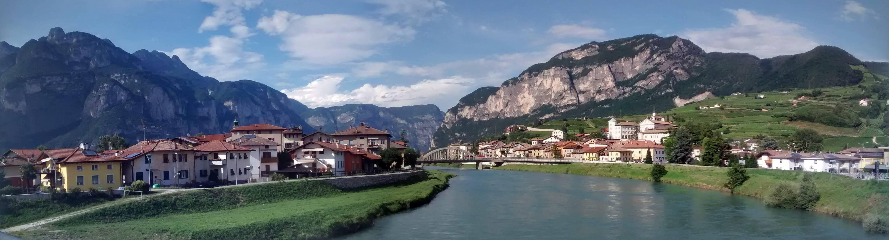
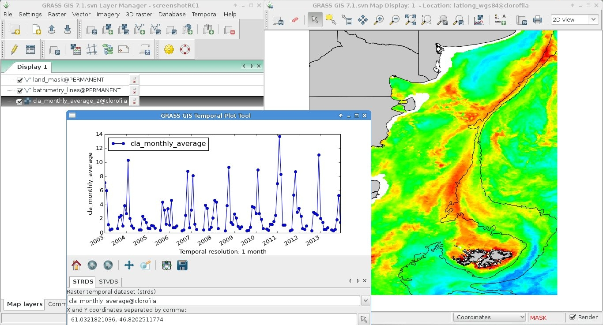
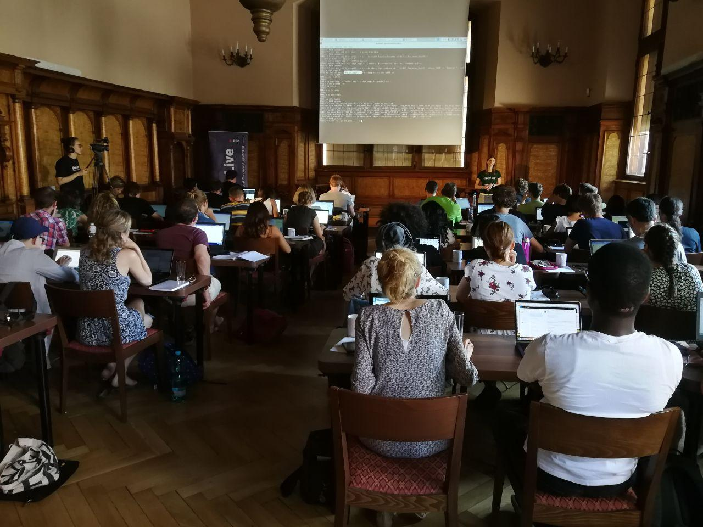
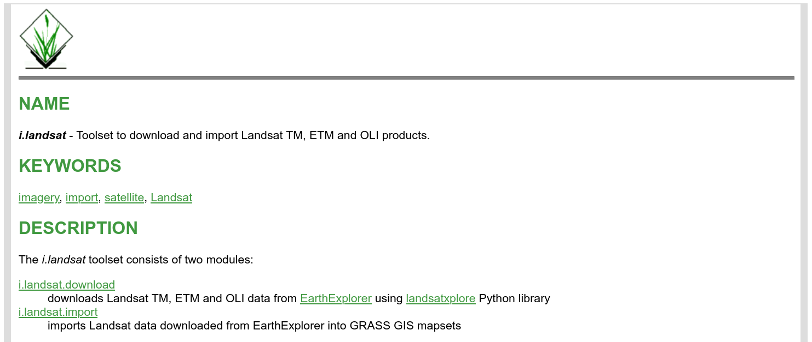
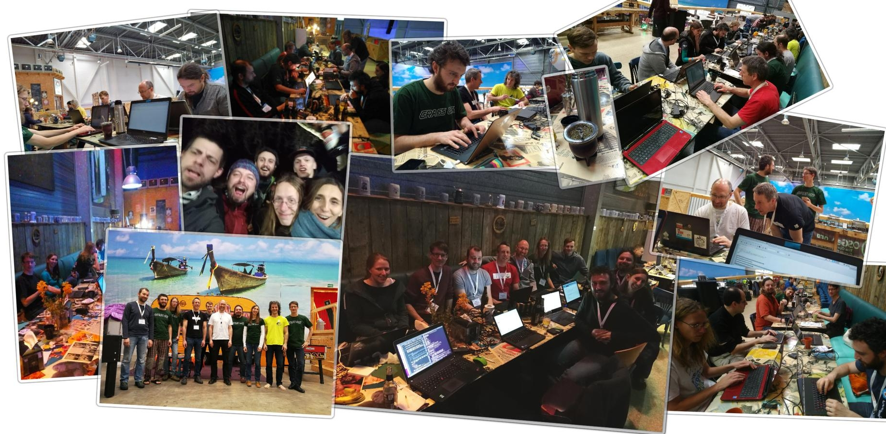

Eight years ago, while doing an MSc in Remote Sensing and GIS Applications
at the Argentinean Space Agency - [CONAE](https://www.argentina.gob.ar/ciencia/conae),
I was looking for places where to do a 6-months internship in Italy. 
I wanted to go completely *FOSS* and I had heard about **GRASS GIS**, but 
hadn't made the time to learn it until then. 
That was when I recalled a former colleague from university mentioning
the keywords *GRASS* and *Markus Neteler*. 
Well, I wrote to him and ended up in Trento by January, 2013 (the pic is
not from January of course!).

From the beginning, I was determined to learn the command line way
of *GRASS-ing*. Luckily, during the internship at the former *PGIS* in 
[FEM](https://www.fmach.it/), I got a lot of support and had the 
chance to participate in code sprints, conferences and meet several 
GRASS GIS core devs and power users. I really loved the software but
*I got hooked by the community behind it* :hugs:

Once back in Argentina, the MSc thesis was a great excuse to learn and
test the freshly developed *temporal framework* and some basic bash to 
write simple scripts. I always received a lot of support from devs and
other users in the 
[mailing list](https://lists.osgeo.org/mailman/listinfo/grass-user).
Please take into account that my background is Biology and I had zero 
coding/programming before this... for me, each step was a huge step! 

From everything I worked on for the MSc thesis, I compiled the 
[Temporal Data Processing](https://grasswiki.osgeo.org/wiki/Temporal_data_processing) 
wiki page and some others that came later. That wiki has been accessed
*127,853* times as of today 30/12/2020! Impressive, eh?

With time, I learnt to create *diffs* which I was sending to other devs 
so they would merge into the source code. It was mostly documentation, 
but hey, one must start somewhere, no? 
Eventually, I became so "bothersome" :innocent:, that they proposed me
as core dev! :nerd_face:
I was given permission to mess up the source code :scream: I didn't, don't worry!
That same year I was nominated as [OSGeo](https://www.osgeo.org/) charter 
member. 
By then, I had already taught some GRASS GIS workshops and courses here 
and there and also organized a 
[code sprint at my house](https://grasswiki.osgeo.org/wiki/GRASS_GIS_Community_Sprint_Autumn_2017)!

While preparing material for those workshops and courses, I started 
learning *git*. This helped me to be (more or less!) ready 
when GRASS moved from svn to [GitHub](https://github.com/OSGeo/grass). 
Furthermore, after setting up my [own website](https://veroandreo.gitlab.io/) 
with Hugo and the Academic theme, I became pretty familiar with such a 
technology. This lead to a strong involvement in the 
[new GRASS website](https://grass.osgeo.org/) that we launched by mid 
2020 for GRASS birthday.
  
By November, I thought **it was time to challenge myself with writing 
an add-on for my favorite software**. I learnt a little bit of Python and 
found something that could be useful to have: a toolset to search, download 
and import Landsat data into GRASS GIS. 
The availability of similar modules helped a lot, I had examples to learn
from. I received a lot of motivation and help from other devs in the 
process. Finally, some days ago, I decided the toolset was ready to be 
shared and I committed it to the official add-ons repo :scream: 
and there it is the 
[**i.landsat**](https://grass.osgeo.org/grass78/manuals/addons/i.landsat.html)
toolset containing 2 modules: 
[*i.landsat.download*](https://grass.osgeo.org/grass78/manuals/addons/i.landsat.download.html) 
and 
[*i.landsat.import*](https://grass.osgeo.org/grass78/manuals/addons/i.landsat.import.html)! 
And my name in a piece of code that everyone can use, review and modify 
:star_struck: 

This experience has definitely reinforced my feeling of **belonging to this
great community**. And, as if all that was not enough, a week ago
I was nominated for the PSC (GRASS GIS Project Steering Committee)! 
What a nice ride so far! :sweat_smile: 

If I could, I'm sure everyone can!! **GRASS GIS will welcome you, come and
join!**

