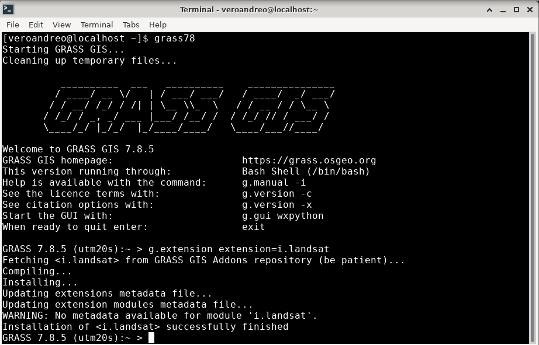
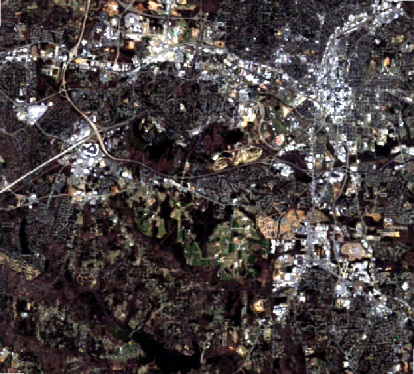
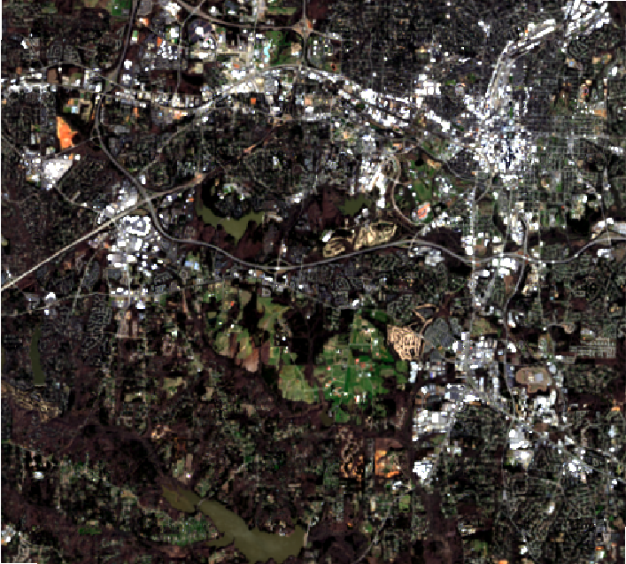
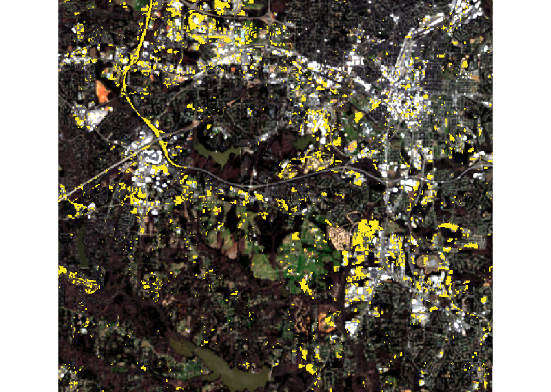

In this tutorial, I'll exemplify different uses of the freshly created 
*i.landsat* toolset and its integration with other GRASS GIS core modules
and add-ons for a full workflow to process Landsat data. 

First of all, to be able to connect to 
[EarthExplorer](https://earthexplorer.usgs.gov/) you'll need a user 
name and password. If you are not yet registered, please see the 
[register](https://ers.cr.usgs.gov/register) 
page for signing up. Then, create a plain text file with your 
credentials: 

```bash
myusername
mypassword
```

We will work in the *landsat* mapset within the North Carolina full
sample location. We first start GRASS GIS and set the computational
region to one of the existent landsat bands there:

```bash
# start grass in landsat mapset
grass78 grassdata/nc_spm_08_grass7/landsat/

# list available raster maps
g.list type=raster mapset=.

# set the computational region
g.region -p raster=lsat7_2000_40

# display the RGB
d.mon wx0
d.rgb red=lsat7_2000_30 green=lsat7_2000_20 blue=lsat7_2000_10
```

Next step is to install the i.landsat toolset via 
[g.extension](https://grass.osgeo.org/grass78/manuals/g.extension.html)
as shown below



The module [i.landsat.download](https://grass.osgeo.org/grass78/manuals/addons/i.landsat.download.html)
allows to search and download Collection 1 Landsat TM, ETM and OLI data from USGS
EarthExplorer through the [landsatxplore](https://github.com/yannforget/landsatxplore)
Python library.

In this example, we will retrieve scenes which footprint intersects the current 
computational region extent. Note however that the area of interest can be optionally
defined by a vector map.

If we have a look at the metadata, the Landsat 7 data already in the sample location
is dated March 31, 2000. 

```bash
r.info map=lsat7_2000_40
```

Hence, to perform change detection we should search for scenes from the same time
of the year, but in this example, for 2010 and 2020. 
We'll first use the `-l` flag to only list available Landsat data.

```bash
# 2010 - Landsat TM
i.landsat.download -l settings=credentials.txt \
    dataset=LANDSAT_TM_C1 clouds=5 \
    start='2010-02-01' end='2010-04-30'
# 3 scenes found.
# LT50160352010078PAC01 LT05_L1TP_016035_20100319_20160904_01_T1 2010-03-19 0.00
# LT50150352010119GNC01 LT05_L1TP_015035_20100429_20160901_01_T1 2010-04-29 0.00
# LT50160352010094EDC00 LT05_L1TP_016035_20100404_20160903_01_T1 2010-04-04 4.00

#2020
i.landsat.download -l settings=credentials.txt \
    dataset=LANDSAT_8_C1 clouds=5 \
    start='2020-02-01' end='2020-04-30'
# 1 scenes found.
# LC80160352020058LGN00 LC08_L1TP_016035_20200227_20200313_01_T1 2020-02-27 0.37
```

We'll download the scenes from March 19, 2010 and February 27, 2020, which is the 
only one found with the search criteria we set. To download only the selected scenes,
we'll pass their IDs via the *id* option. 

```bash
i.landsat.download settings=credentials.txt \
  id=LT50160352010078PAC01,LC80160352020058LGN00 \
  output=landsat_data
```

Now that we have downloaded the Landsat scenes, we need to import them into GRASS GIS.
For that purpose we use the second module in the toolset: 
[i.landsat.import](https://grass.osgeo.org/grass78/manuals/addons/i.landsat.import.html).
By default, it imports all Landsat bands within the scene files found 
in the *input* directory. In this case, we'll keep this option, but since we are
only interested in the region defined by the Landsat bands already present in 
the mapset, we'll limit the import with `extent=region`. Furthermore, since 
Landsat data comes in UTM coordinate reference system, we'll need to re-project
the data. This will be done during import by means of 
[r.import](https://grass.osgeo.org/grass78/manuals/r.import.html) when we set the
`-r` flag. Let's first have a look at the files that will be imported:

```bash
# print all landsat bands to import within the landsat_data folder
i.landsat.import -p input=landsat_data
# /landsat_data/LT05_L1TP_016035_20100319_20160904_01_T1_B7.TIF 0 (EPSG: 32617)
# /landsat_data/LT05_L1TP_016035_20100319_20160904_01_T1_B6.TIF 0 (EPSG: 32617)
# /landsat_data/LT05_L1TP_016035_20100319_20160904_01_T1_B5.TIF 0 (EPSG: 32617)
# /landsat_data/LT05_L1TP_016035_20100319_20160904_01_T1_B4.TIF 0 (EPSG: 32617)
# ...
# /landsat_data/LC08_L1TP_016035_20200227_20200313_01_T1_B7.TIF 0 (EPSG: 32617)
# /landsat_data/LC08_L1TP_016035_20200227_20200313_01_T1_B6.TIF 0 (EPSG: 32617)
# /landsat_data/LC08_L1TP_016035_20200227_20200313_01_T1_B5.TIF 0 (EPSG: 32617)
```

Now, we actually import the data and check the list of imported maps:

```bash
# import all bands, subset to region setting and reproject on the fly
i.landsat.import -r input=landsat_data extent=region

# list raster maps
g.list type=raster mapset=.
```

Let's also check the metadata and display the respective RGB combinations.

```bash
# check metadata
r.info LT05_L1TP_016035_20100319_20160904_01_T1_B3
```

First, we set all color tables to grey and perform color enhancing for a better
visualization

```bash
i.colors.enhance \
  red=LT05_L1TP_016035_20100319_20160904_01_T1_B3 \
  green=LT05_L1TP_016035_20100319_20160904_01_T1_B2 \
  blue=LT05_L1TP_016035_20100319_20160904_01_T1_B1

i.colors.enhance \
  red=LC08_L1TP_016035_20200227_20200313_01_T1_B4 \
  green=LC08_L1TP_016035_20200227_20200313_01_T1_B3 \
  blue=LC08_L1TP_016035_20200227_20200313_01_T1_B2
```

And then we can use either the main GUI or the interactive monitors
called from the terminal as follows:

```bash
d.mon wx0
d.rgb red=LT05_L1TP_016035_20100319_20160904_01_T1_B3 \
  green=LT05_L1TP_016035_20100319_20160904_01_T1_B2 \
  blue=LT05_L1TP_016035_20100319_20160904_01_T1_B1

d.mon wx1
d.rgb red=LC08_L1TP_016035_20200227_20200313_01_T1_B4 \
  green=LC08_L1TP_016035_20200227_20200313_01_T1_B3 \
  blue=LC08_L1TP_016035_20200227_20200313_01_T1_B2
```

<pre>

</pre>

Since we are interested in performing change detection among two different dates, we 
need to perform atmospheric correction first. To that aim, we use the
[i.landsat.toar](https://grass.osgeo.org/grass78/manuals/i.landsat.toar.html) module.
In this case, we use the simple DOS algorithm but a more sophisticated method is 
provided in [i.atcorr](https://grass.osgeo.org/grass78/manuals/i.atcorr.html).

```bash
i.landsat.toar input=LT05_L1TP_016035_20100319_20160904_01_T1_B \
  output=LT05_L1TP_016035_20100319_toar_B \
  sensor=tm5 \
  metfile=LT05_L1TP_016035_20100319_20160904_01_T1_MTL.txt \
  method=dos1

i.landsat.toar input=LC08_L1TP_016035_20200227_20200313_01_T1_B \
  output=LC08_L1TP_016035_20200227_toar_B \
  sensor=oli8 \
  metfile=LC08_L1TP_016035_20200227_20200313_01_T1_MTL.txt \
  method=dos1
```

Now, we'll estimate the tasseled cap transformation with 
[i.tasscap](https://grass.osgeo.org/grass78/manuals/i.tasscap.html).
The tasseled cap transformation is effectively a compression method to reduce 
multiple spectral data into a few bands. The method was originally developed 
for understanding important phenomena of crop development in spectral space. 
It is generally accepted that the first component is *brightness*, the second
*greennes* and the third one, *wetness*.

```bash
i.tasscap \
  input=LT05_L1TP_016035_20100319_toar_B1,LT05_L1TP_016035_20100319_toar_B2,LT05_L1TP_016035_20100319_toar_B3,LT05_L1TP_016035_20100319_toar_B4,LT05_L1TP_016035_20100319_toar_B5,LT05_L1TP_016035_20100319_toar_B7 \
  output=L5_2010_tasscap \
  sensor=landsat5_tm

i.tasscap \
  input=LC08_L1TP_016035_20200227_toar_B2,LC08_L1TP_016035_20200227_toar_B3,LC08_L1TP_016035_20200227_toar_B4,LC08_L1TP_016035_20200227_toar_B5,LC08_L1TP_016035_20200227_toar_B6,LC08_L1TP_016035_20200227_toar_B7 \
  output=L8_2020_tasscap \
  sensor=landsat8_oli
```

Finally, we use the **change vector analysis (CVA)**, a common method to perform the change 
detection analysis, by providing the *brightness* and *greenness* features of the 
tasseled cap transform we just did. As input for CVA, two maps for each date must be given:
in general, on the X axis an indicator of overall reflectance and on the Y axis an indicator
of vegetation conditions. Hence, our choice for components 1 and 2 of tasseled cap.

```bash
i.cva \
  xaraster=L5_2010_tasscap.1 xbraster=L8_2020_tasscap.1 \
  yaraster=L5_2010_tasscap.2 ybraster=L8_2020_tasscap.2 \
  output=CVA_2010_2020 stat_threshold=1
```

As an output, we obtain 4 maps: 

- angle: map of the angles of the change vector between the two dates;
- angle_class: map of the angles, classified in four quadrants (0-90, 90-180, 180-270, 270-360);
- magnitude: map of the magnitudes of the change vector between the two dates;
- change: final map of change 

The change map is created using the classified angle map and applying a threshold 
to the magnitude. Pixels that have values higher than the threshold are divided in
four categories depending on the quadrant they belong to. In this case, with 
default options, we detect only one type of change shown in yellow below. 
Have a look at [Karnieli et al. 2014](https://www.mdpi.com/2072-4292/6/10/9316) 
for a conceptual diagram explaining the different types of changes.


