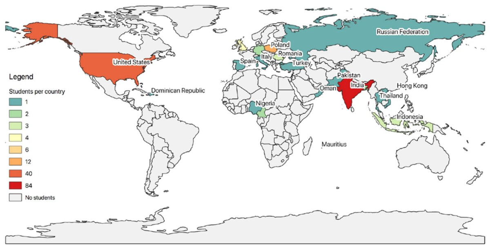

[PDF](https://doi.org/10.5194/isprs-archives-XLII-4-W8-175-2018)

## Abstract

The Open Source Geospatial Foundation's (OSGeo) vision is to empower everyone, from pre-university students to professionals, with open source geospatial applications, tools and resources. In 2017, OSGeo decided to participate for the first time in the Code-in competition. Google Code-in (GCI) is an annual online competition aimed at introducing pre-university students (13-17 years) to open source projects, development and communities, through short 3-5 hour tasks. This is a unique opportunity to interact with pre-university students and to encourage them to become part of OSGeo. In this paper, we present OSGeo's involvement in GCI with the purpose of establishing lessons learned to improve our approach in the next editions of GCI. Over the 51 days of the competition, 279 students completed 649 OSGeo tasks. Students consistently communicated with the mentors to discuss submission and receive inputs from the wide community of developers too. During the GCI, the mentors reviewed the students' work and provided suggestions and feedback. Generally, the submissions were good and some of them are now part of the projects. As this was our first time participating in GCI these issues are seen as lessons learned and strategies to improve the process will be implemented based on the mentors' experience. It is key to encourage these students to continue contributing to the OSGeo community, as they will bring new energy and ideas into the organisation; for many of these young students, this competition is a way to introduce them to the geospatial industry.

{fig-alt="Number of students per country that participated in OSGeo tasks during the Google Code-in competition." .featured-figure}

## Citation

V. Rautenbach, M. Di Leo, V. Andreo, L. Delucchi, H. Kudrnovsky, J. McKenna, et al. (2018). Fostering pre-university student participation in OSGeo through the Google Code-in competition. *ISPRS - International Archives of the Photogrammetry, Remote Sensing and Spatial Information Sciences, (XLII-4/W8), pp. 175--180*. <https://doi.org/10.5194/isprs-archives-XLII-4-W8-175-2018>
