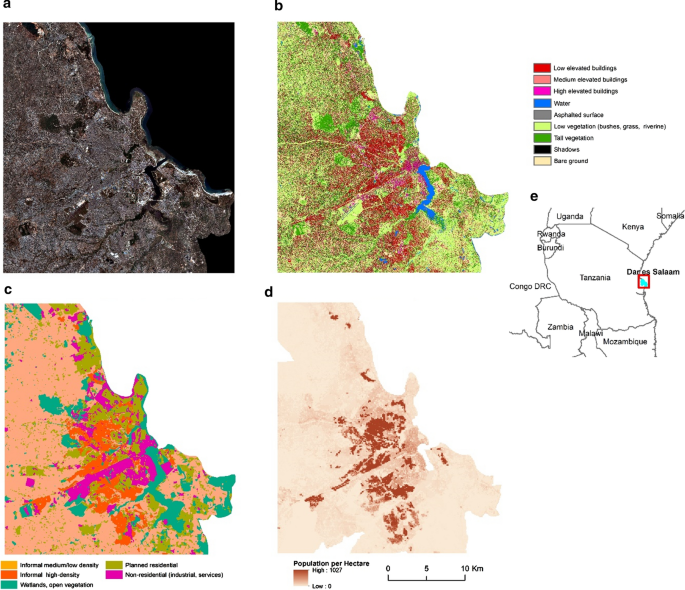

[PDF](https://doi.org/10.1186/s12942-020-00232-2)

## Abstract

The rapid and often uncontrolled rural–urban migration in Sub-Saharan Africa is transforming urban landscapes expected to provide shelter for more than 50% of Africa’s population by 2030. Consequently, the burden of malaria is increasingly affecting the urban population, while socio-economic inequalities within the urban settings are intensified. Few studies, relying mostly on moderate to high resolution datasets and standard predictive variables such as building and vegetation density, have tackled the topic of modeling intra-urban malaria at the city extent. In this research, we investigate the contribution of very-high-resolution satellite-derived land-use, land-cover and population information for modeling the spatial distribution of urban malaria prevalence across large spatial extents. As case studies, we apply our methods to two Sub-Saharan African cities, Kampala and Dar es Salaam. Openly accessible land-cover, land-use, population and OpenStreetMap data were employed to spatially model *Plasmodium falciparum* parasite rate standardized to the age group 2–10 years (PfPR2–10) in the two cities through the use of a Random Forest (RF) regressor. The RF models integrated physical and socio-economic information to predict PfPR2–10 across the urban landscape. Intra-urban population distribution maps were used to adjust the estimates according to the underlying population. The results suggest that the spatial distribution of PfPR2–10 in both cities is diverse and highly variable across the urban fabric. Dense informal settlements exhibit a positive relationship with PfPR2–10 and hotspots of malaria prevalence were found near suitable vector breeding sites such as wetlands, marshes and riparian vegetation. In both cities, there is a clear separation of higher risk in informal settlements and lower risk in the more affluent neighborhoods. Additionally, areas associated with urban agriculture exhibit higher malaria prevalence values. The outcome of this research highlights that populations living in informal settlements show higher malaria prevalence compared to those in planned residential neighborhoods. This is due to (i) increased human exposure to vectors, (ii) increased vector density and (iii) a reduced capacity to cope with malaria burden. Since informal settlements are rapidly expanding every year and often house large parts of the urban population, this emphasizes the need for systematic and consistent malaria surveys in such areas. Finally, this study demonstrates the importance of remote sensing as an epidemiological tool for mapping urban malaria variations at large spatial extents, and for promoting evidence-based policy making and control efforts.

{fig-alt="Predicted PfPR2_10 in 2 locations in Dar es Salaam. a Intensified urban agriculture across the Mbezi river, c distinction of estimates across the dense slums and planned neighborho" .featured-figure}

## Citation

S. Georganos, O. Brousse, S. Dujardin, C. Linard, D. Casey, M. Milliones, et al. (2020). Modelling and mapping the intra-urban spatial distribution of *Plasmodium falciparum* parasite rate standardized to the age group 2-10 years using Very-High-Resolution Satellite Derived Indicators in Sub-Saharan African Cities. *International Journal of Health Geographics, (19), 38*. <https://doi.org/10.1186/s12942-020-00232-2>
