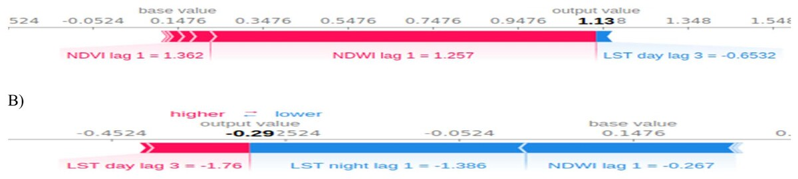

[PDF](https://doi.org/10.1109/ARGENCON49523.2020.9505575)

## Abstract

Dengue fever, Chikungunya and Zika, are vector borne diseases transmitted by mosquitoes of the species *Aedes aegypti*. Previous studies have shown the usefulness of machine learning techniques to model the temporal variability of this vector based on satellite time series data. In this paper we present the use of “SHapley Additive exPlanations” (SHAP) for the evaluation of the contribution of each variable in Machine Learning models. Results show how environmental variables influence the response variable differently at different times of the year. NDWI, night temperature with lag 1 and diurnal temperature with lag 3 are the most important variables, as well as the interaction between them. The routines and techniques used are described and available to the reader so that they can be applied to other modeling studies.

{fig-alt="SHAP force plots showing how each environmental variable contributes to the model prediction." .featured-figure}

## Citation

J. M. Scavuzzo, C. M. Scavuzzo, M. Espinosa, V. Andreo, M. N. Campero, V. Periago, et al. (2020). Estimación de la importancia de variables predictoras en modelos epidemiológicos de aprendizaje automático utilizando SHAP. *2020 IEEE Congreso Bienal de Argentina (ARGENCON), pp. 1--6*. <https://doi.org/10.1109/ARGENCON49523.2020.9505575>
