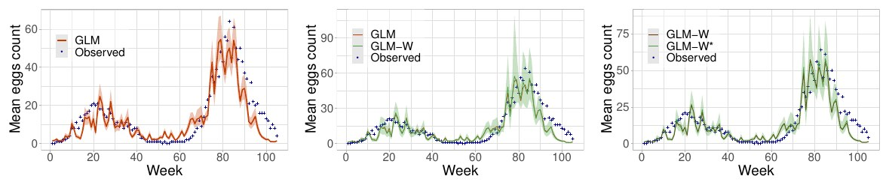

[PDF](https://doi.org/10.1109/IGARSS47720.2021.9554002)

## Abstract

Here, we present a method for temporal modeling of the oviposition activity of *Ae. aegypti* mosquitoes based on a weighted generalised linear model (GLM) with explanatory environmental effects extracted from freely available remotely sensing (satellite) images. Our results show potential for operational applications. Experimental results are provided using field collected *Ae. aegypti* eggs count data in Córdoba, Argentina.

{fig-alt="Observed and predicted mean egg counts per week for the fitted generalized linear models." .featured-figure}

## Citation

O. Mudele, V. Andreo, X. Porcasi, C. M. Scavuzzo, L. Lopez, P. Gamba (2021). Predicting *Aedes aegypti* eggs count using remote sensing data and a generalized linear model. *2021 IEEE International Geoscience and Remote Sensing Symposium IGARSS, pp. 84--87*. <https://doi.org/10.1109/IGARSS47720.2021.9554002>
