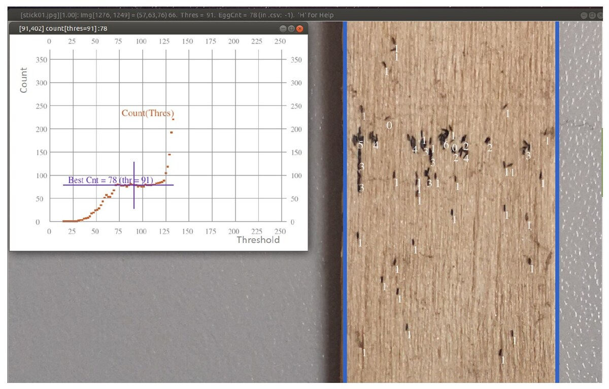

[PDF](https://doi.org/10.1109/IGARSS47720.2021.9555005)

## Abstract

Oviposition measurement with ovitraps is one of the most widely used methods to monitor *Aedes aegypti* mosquito activity in the world. Egg counting is however very time consuming. This paper presents the semi-automatic counting of mosquito eggs laid on ovitrap sticks in images acquired by cellular phones. In Cordoba, Argentina, 150 ovitraps were distributed in the city to measure the evolution of the *Aedes aegypti* population, estimated indirectly by the number of laid eggs. An important increase in the counts is a potential indicator of an imminent outbreak, alerting the health services to warn the population and recall the good sanitary practices. Bringing image processing to this project is a way to relieve the technician from the tedious egg counting behind a magnifier and to reduce the count errors due to distraction or fatigue. We developed a fast semi-automatic counting solution with tools to focus on the useful image area, to show the confidence of automatic count numbers and to handle the collection of results.

{fig-alt="Interface of the semi-automatic egg counting tool, showing an ovitrap stick image and the count confidence curve." .featured-figure}

## Citation

C. Beumier, J. Rubio, V. Andreo, C. Guzman, X. Porcasi, C. M. Scavuzzo, et al. (2021). Semi-automatic tool to count mosquito eggs in ovitrap stick images. *2021 IEEE International Geoscience and Remote Sensing Symposium IGARSS, pp. 80--83*. <https://doi.org/10.1109/IGARSS47720.2021.9555005>
