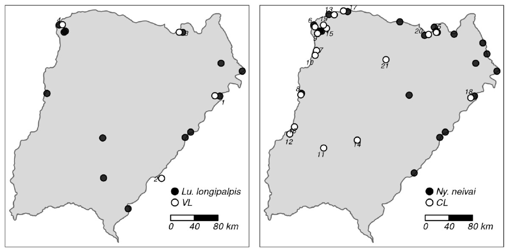

[PDF](https://doi.org/10.25085/rsea.810408)

## Abstract

We updated the distribution of Phlebotominae (Diptera: Psychodidae) species and human cases of leishmaniasis in the Province of Corrientes, Argentina. *Evandromyia correalimai* (Martins, Coutinho & Lutz, 1970) is a new record for the province, reported in the urban area of Santo Tomé. We include the currently known distribution map of Phlebotominae sandfly species in Corrientes, and the localities where they were recorded, as well as a map of vector species and reported human cases of leishmaniases.

{fig-alt="Distribution of *Lutzomyia longipalpis* and *Nyssomyia neivai* and of human cases of leishmaniasis in Corrientes Province, Argentina." .featured-figure}

## Citation

M. L. Villarquide, V. Andreo, O. D. Salomon, M. S. Santini (2022). Distribution of Phlebotominae (Diptera: Psychodidade) species and human cases of leishmaniasis in the Province of Corrientes, Argentina. *Revista de la Sociedad Entomológica Argentina, 81, pp. 55--63*. <https://doi.org/10.25085/rsea.810408>
