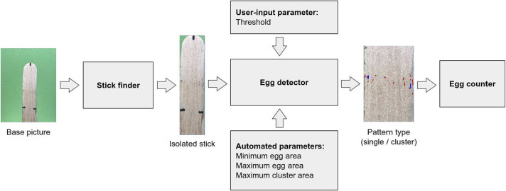

[PDF](https://doi.org/10.1016/j.ecoinf.2023.102105) · [Code](https://gitlab.com/charles.hamesse/ovitrap-monitor-server) · [Dataset](https://zenodo.org/record/6962536) · [Project](https://ovitrap-monitor.netlify.app/)

## Abstract

Ovitraps are a widely used method for mosquito detection and monitoring, especially *Aedes* mosquitoes. Eggs present in ovitraps must be routinely counted to generate up-to-date information on potential spread of mosquito-borne diseases. This task is tedious, time consuming and prone to errors if done manually by eye counting. In this contribution, we introduce the Ovitrap Monitor, an online open source and user-friendly integrated application that semi-automatically counts mosquito eggs from low-medium resolution mobile phone pictures. A high correlation was found between counts performed manually by a technician and those obtained with the app using an extensive dataset of more than 750 ovitrap pictures. The application features an intuitive user interface and time-series plots and maps to facilitate data flow and speed up evidence-based decision-making within health organisations battling mosquito-borne diseases. Besides being open source, the Ovitrap Monitor is also backed by test data to guarantee its implementation through benchmarking and enforce research in the public health field.

{fig-alt="Main components of the egg counting algorithm that is included within Ovitrap Monitor." .featured-figure}

## Citation

C. Hamesse, V. Andreo, C. Rodriguez Gonzalez, C. Beumier, J. Rubio, X. Porcasi, et al. (2023). Ovitrap Monitor - Online application for counting mosquito eggs and visualisation toolbox in support of health services. *Ecological Informatics, (75), 102105*. <https://doi.org/10.1016/j.ecoinf.2023.102105>
