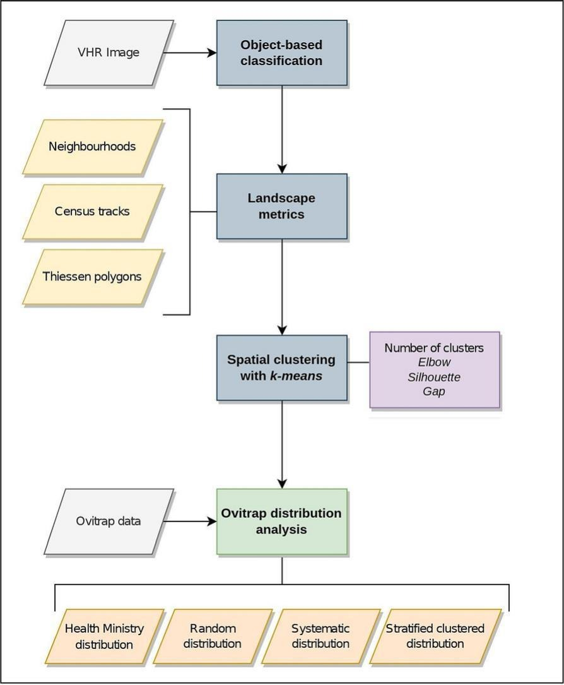

[PDF](https://doi.org/10.1016/j.ecoinf.2023.102221)

## Abstract

Surveillance is critical to efficiently control and prevent mosquito-borne diseases such as Dengue. Surveillance relies on sampling the target region for arthropod vectors over time. However, in most cases the sampling framework is ad hoc and relies only on expert opinion. We sought to improve the efficiency of mosquito surveillance in Córdoba (Argentina) by designing a spatial sampling scheme within complex urban areas that would optimize ovitrap collections. We classified a very high resolution (VHR) satellite image following an object based (OBIA) approach and estimated several landscape metrics over which we applied a k-means clustering. The objective was to identify an optimal distribution for the ovitrap network characterizing the urban coverage of the city at three types of territorial units: neighbourhoods, census tracts and Thiessen polygons around health care facilities. We distributed 150 ovitraps throughout the city based on the identified environmental groups and compared results with the current strategy used by the Ministry of Health. Stratified ovitrap distributions for census tracts or Thiessen polygons performed best compared to the current strategy in terms of environmental variability covered, i.e., relevant environmental groups are either subsampled or oversampled in the current distribution. Because of the general availability of these environmental data sets and algorithms, the approach could be applied in most urban areas where vector borne disease control is challenging.

{fig-alt="Workflow of the implemented approach to distribute mosquito ovitraps within a city based on VHR satellite imagery, OBIA and landscape metrics." .featured-figure}

## Citation

C. Rodriguez Gonzalez, C. Guzman, V. Andreo (2023). Using VHR satellite imagery, OBIA and landscape metrics to improve mosquito surveillance in urban areas. *Ecological Informatics, (77), 102221*. <https://doi.org/10.1016/j.ecoinf.2023.102221>
