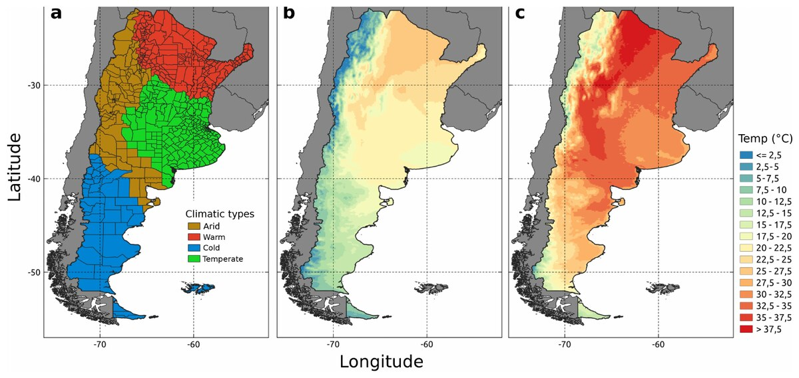

[PDF](https://doi.org/10.1109/RPIC59053.2023.10530696)

## Abstract

Heatwaves are an emerging public concern due to their increasing impacts on global health and economy. The ERA5-Land air temperature product (a freely available reanalysis product from the Copernicus Program), offers a quality controlled and continuous database, which significantly improves the scale and accuracy with respect to point measurements or interpolations between meteorological stations currently used to detect heatwaves in Argentina. In this work we utilized the ERA5-Land product, an open-source software to process 30 years of daily temperature data. We were able to identify the extreme temperature anomalies by calculating the 90th percentile on both minimum and maximum daily temperatures and to determine heatwaves that impacted Argentina over the last 30 years. In addition, a time series clustering algorithm was applied to explore spatio-temporal patterns of these heatwaves, showing three different patterns along the country. An increasing trend in the number of heatwaves through time was also identified for almost the entire country, with the exception of northwestern Argentina and the coastal areas below the 40° parallel. The results of this work are valuable data that will be used in an environmental epidemiology study along Argentina.

{fig-alt="Climatic types and mean temperature over Argentina derived from the ERA5-Land reanalysis product." .featured-figure}

## Citation

J. D. Pinotti, V. Andreo, S. Muñoz, J. Koristschoner, X. Porcasi (2023). Unveiling Argentina's heatwaves: a comprehensive and open analysis of the last 30 years using the ERA5-Land reanalysis product. *2023 XX Workshop on Information Processing and Control (RPIC), pp. 188--193*. <https://doi.org/10.1109/RPIC59053.2023.10530696>
