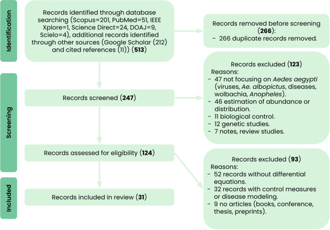

[PDF](https://doi.org/10.1016/j.actatropica.2024.107459)

## Abstract

The global spread of *Aedes aegypti* and the associated public health risk have stimulated the development of several mathematical models to predict population dynamics in response to biological or environmental changes in real, future, or simulated scenarios. The aim of this study is to identify published articles on differential equation-based population dynamics models of *Aedes aegypti*, highlight their differences and commonalities, and examine their application in surveillance and control programs. Following the PRISMA guidelines, a systematic review was conducted in seven electronic databases (Scopus, PUBMED, IEEE Xplore, Science Direct, DOAJ, Scielo, and Google Scholar), with the last update on 8 February 2023. The initial search yielded 513 studies, of which 31 were finally selected. The articles analyzed showed great variability in the equations, processes, and variables included, with temperature being the most common environmental factor. Only a few models incorporated spatial heterogeneity or validation methods. Our findings suggest that improving the generation of temporal and spatially explicit forecasts through interdisciplinary collaboration, the use of new technologies, and validation with field data is essential for these models to effectively support public health efforts. Differential equation-based population dynamics models offer valuable insights and could greatly benefit mosquito surveillance programs if standardized and tailored to relevant scales.

{fig-alt="PRISMA flow diagram illustrating the article's selection process." .featured-figure}

## Citation

T. V. San Miguel, D. Da Re, V. Andreo (2024). A systematic review of *Aedes aegypti* population dynamics models based on differential equations. *Acta Tropica, (260), 107459.*. <https://doi.org/10.1016/j.actatropica.2024.107459>
