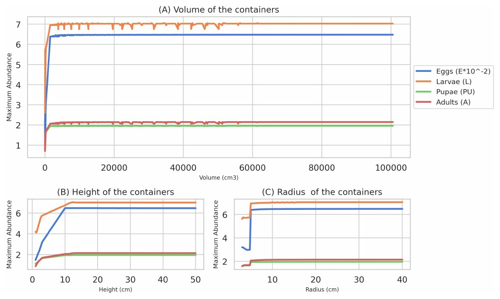

## Abstract

Mathematical models are valuable tools for public health decision-making. This study evaluated the local sensitivity of an ODE-based model of *Aedes aegypti* population dynamics. The model is implemented within an operational system to forecast species abundance. Over 700 simulations were run to assess the influence of 24 model inputs, including fixed, temperature- and water-dependent parameters, meteorological variables, and container characteristics. Adult mortality, emergence factor, and larval development rate were the most influential parameters. Among the meteorological variables, relative humidity produced the largest deviations with positive variations, while temperature produced the largest deviations with negative variations. A saturation limit was identified for containers with a volume of approximately 1.5 l, a height of 10 cm, and a radius of 5 cm, beyond which no further significant increase in mosquito abundance was observed.

{fig-alt="Maximum abundance of each mosquito life stage as a function of container volume, height and radius." .featured-figure}

## Citation

T. V. San Miguel, M. A. Sgró, V. Andreo (2025). One-way sensitivity analysis of an ODE-based *Aedes aegypti* model driven by meteorological data. *X Congreso de Matemática Aplicada, Computacional e Industrial (MACI), (10), pp. 606--609*.
