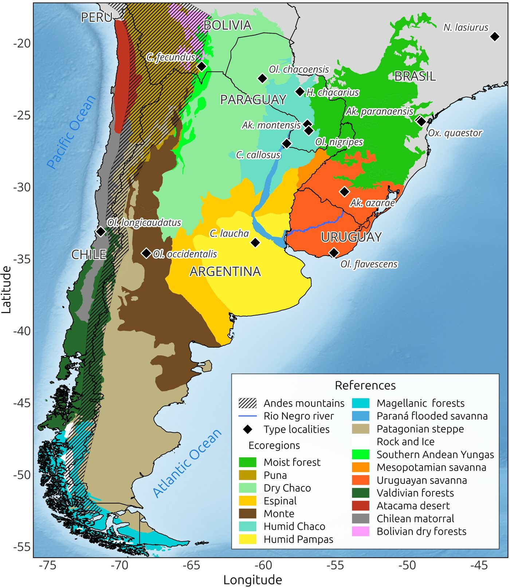

[PDF](https://doi.org/10.1371/journal.pntd.0013489)

## Abstract

Orthohantaviruses, family Hantaviridae, are zoonotic agents that pose a significant public health threat, particularly in South America, where they cause severe respiratory illnesses in humans. Despite their importance, knowledge gaps remain regarding the distributions of both the viruses and their rodent hosts in Southern South America, a region characterized by a great complexity of viral genotypes and reservoirs. This review provides an updated overview of orthohantavirus hosts and their associated viral genotypes in Argentina, Chile, Paraguay, and Uruguay. Through an extensive literature review, we identified 14 rodent species that serve as reservoir hosts for 15 distinct orthohantavirus genotypes. These rodent hosts inhabit a variety of ecosystems, from forests and arid zones to grasslands and wetlands, and even modified or anthropized habitats, demonstrating a wide geographic and ecological range. Our findings highlight the diversity of orthohantaviruses in this region, reflecting their complex evolutionary histories. Maintaining an up-to-date knowledge base on this topic is essential for effective decision-making in public health.

{fig-alt="Type localities of orthohantavirus reservoir hosts detected in Southern South America." .featured-figure}

## Citation

N. Ortiz, J. D. Pinotti, V. Andreo, R. E. Gonzalez-Ittig, N. C. Gardenal (2025). Orthohantavirus rodent hosts and genotypes in Southern South America: A narrative review. *PLOS Neglected Tropical Diseases, 19(9), e0013489.*. <https://doi.org/10.1371/journal.pntd.0013489>
