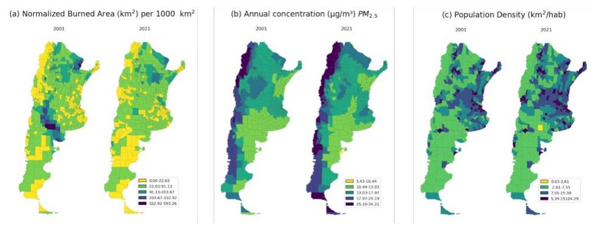

[PDF](https://doi.org/10.1109/RPIC67987.2025.11260709)

## Abstract

Asthma remains a major public health concern in Latin America, where underreporting and unequal access to healthcare services challenge accurate assessments of its prevalence and mortality. In this study, we explored the use of remote sensing data and machine learning techniques to predict asthma mortality in Argentina at departmental level from 2001 to 2022. We used the Random Forest (RF) algorithm to model the Normalized Asthma Mortality Rate (NAMR). A walk-forward validation approach with expanding windows was applied to train, test, and tune a RF model in a two-stage approach—classification followed by regression—using predictor variables derived from satellite-based observations such as burned areas, and Particulate Matter with 2.5 micrometers in diameter or less (PM2.5), along with Population Density (PD), and lagged and feature engineered variables. Exploratory spatial analyses revealed a weak but statistically significant spatial autocorrelation in NAMR and stronger spatial autocorrelation in PD. The walk-forward validation approach showed that RF classification model was able to correctly identify most departments with asthma mortality (mean accuracy 0.775 ± 0.012), although it tended to miss a proportion of actual cases (mean recall 0.611 ± 0.047). The RF regression model demonstrated a moderate ability to explain variations in NAMR across departments (mean R² 0.440 ± 0.138). SHAP (SHapley Additive exPlanations) analysis highlighted PD, past mortality rates, and the PD×PM2.5 interaction as the main factors contributing to the 2022 NAMR predictions. Our findings underscore the potential of integrating remotely sensed environmental data and machine learning for identifying asthma mortality risk patterns in data-sparse settings.

{fig-alt="Normalized burned area, annual PM2.5 concentration and population density across Argentinian departments." .featured-figure}

## Citation

A. Coiman, M. F. Garcia Ferreyra, V. Andreo (2025). Predicting asthma mortality in Argentina using remote sensing data and machine learning. *2025 XXI Workshop on Information Processing and Control (RPIC), pp. 1--6*. <https://doi.org/10.1109/RPIC67987.2025.11260709>
