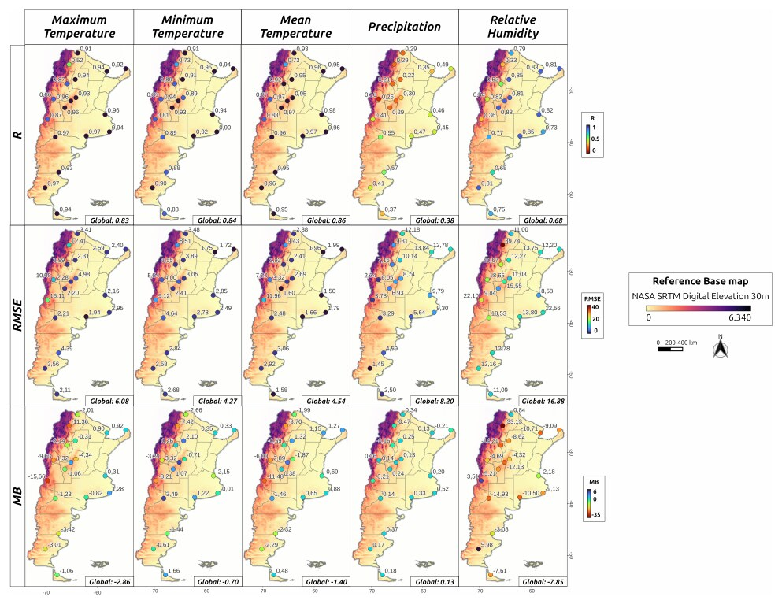

[PDF](https://doi.org/10.1109/RPIC67987.2025.11260742)

## Abstract

The increasing availability of global meteorological data has enabled it to be used as input for multiple environmental and climate-driven models. However, the accuracy of these datasets can vary depending on the climatic variable, region, and spatial scale considered. This study evaluated the performance of two global datasets, NCEP GDAS/FNL and GPM 3IMERGDL, in Argentina between 2015 and 2024. These datasets were selected based on their use in a population dynamics model of *Aedes aegypti*. Five climatic variables were analysed: minimum, mean and maximum temperature; precipitation; and relative humidity. Modelled data were compared with observations from 18 weather stations across 12 Argentinian climatic zones. Temporal analysis included calculating daily bias and evaluating seasonal differences using linear mixed models. Spatially, performance metrics (correlation, RMSE and mean bias) and their relationship with geographical variables (latitude, longitude and altitude) were assessed using multiple regression. Significant inter-seasonal biases were detected in all three temperatures and in relative humidity. Thermal variables showed strong correlation (R > 0.8) and low error (RMSE between 4.3 and 6.0 °C). Precipitation and relative humidity exhibited a weaker fit (R of 0.38 and 0.68, respectively) and greater spatial variability. Regression analysis revealed that altitude was the main driver of spatial variation in temperature error, whereas latitude and longitude influenced precipitation error. These findings highlight the need to validate global datasets in relation to the geographical and temporal context of application.

{fig-alt="Correlation, RMSE and mean bias of the global meteorological datasets for each climatic variable across Argentina." .featured-figure}

## Citation

T. V. San Miguel, D. Da Re, V. Andreo (2025). Assessing the accuracy of global meteorological datasets for climate-sensitive disease vector modelling: insights from Argentina. *2025 XXI Workshop on Information Processing and Control (RPIC), pp. 1--6*. <https://doi.org/10.1109/RPIC67987.2025.11260742>
