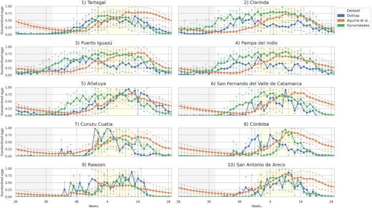

[PDF](https://doi.org/10.1016/j.actatropica.2026.108204)

## Abstract

Vector-borne diseases are expanding geographically, increasing the demand for reliable mosquito surveillance tools. Mechanistic models offer biologically grounded representations of mosquito population dynamics, yet their ability to generalise beyond their calibration conditions remains poorly investigated, mainly due to the scarcity of extensive longitudinal validation datasets. We evaluated two climate-driven models of *Aedes aegypti* population dynamics, one deterministic (Aguirre et al.) and one stochastic (DynamAedes), against weekly ovitrap data collected between 2015 and 2024 in ten Argentine localities spanning a broad climatic and latitudinal gradient. We assessed the model simulations in terms of spatio-temporal performance, peak detection, and seasonal timing (onset, end, and duration), using standardised egg-abundance time series (0-1 scale) for validation. Both models reproduced broad seasonal patterns, though performance varied by locality. The stochastic model exhibited local extinction events in the four southernmost localities, while the deterministic model predicted persistent near-zero abundance only in the driest locality. Weekly RMSE between observed and simulated data remained below 35% across all localities for both models. The Aguirre et al. model showed peak frequency closer to observations, whereas DynamAedes achieved higher detection sensitivity (43.5% versus 27.2%). Seasonal timing analyses revealed biases, including earlier onset and longer predicted seasons, particularly for DynamAedes. Overall, both models captured relevant features of *Ae. aegypti* population dynamics, but predictive performance was strongly context-dependent. These findings underscore the need for robust multi-site validation supported by long-term entomological data and stakeholder involvement in model co-development prior to operational use.

{fig-alt="Observed (ovitrap) and simulated standardised egg abundance by the Aguirre et al. and DynamAedes models in the 10 Argentine localities studied." .featured-figure}

## Citation

T. V. San Miguel, D. Da Re, M. O. Espinosa, M. V. Periago, L. Lopez, C. Guzman, et al. (2026). How much can mosquito population dynamics models inform entomological surveillance? Assessing the transferability of *Aedes aegypti* climate-driven models in Argentina. *Acta Tropica, (280), 108204.*. <https://doi.org/10.1016/j.actatropica.2026.108204>
