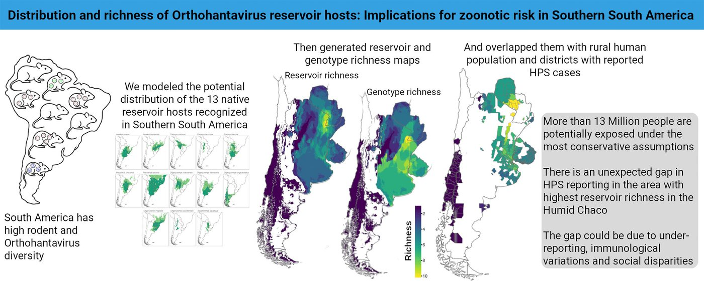

[PDF](https://doi.org/10.1016/j.actatropica.2026.108234)

## Abstract

Orthohantaviruses represent a major zoonotic threat in Southern South America (SSA), where 13 native rodent species are recognized reservoir hosts of 15 different viral genotypes. The information on their geographic distribution remains scattered, limiting regional assessments of exposure risk. We compiled and curated occurrence records for the Orthohantavirus reservoir hosts in SSA and used ecological niche modeling to estimate their potential distributions. We integrated binary presence predictions to map reservoir and genotype richness as well as reservoir assemblages. The richness maps were combined with gridded human population data to estimate the number of people potentially exposed. Most Orthohantavirus reservoir species in SSA are distributed over eastern and northeastern Argentina, parts of Paraguay, Uruguay, and southern Brazil. Hotspots of reservoir richness were concentrated in the Humid Chaco, while the area of high genotype richness extends across the Chaco-Pampean plain. Exposure to a high diversity of pathogenic genotypes (≥7) was estimated to exceed 13 million people under the most precautionary scenario. This study provides the first integrated, region-wide assessment of Orthohantavirus reservoir distributions and richness in SSA, offering an updated ecological baseline to support surveillance, risk mapping, and prevention strategies.

{fig-alt="Graphical abstract: potential distribution of the 13 native reservoir hosts, resulting reservoir and genotype richness maps, and their overlap with rural human population and distr" .featured-figure}

## Citation

J. D. Pinotti, V. Andreo (2026). Distribution and richness of Orthohantavirus reservoir hosts: Implications for zoonotic risk in southern South America. *Acta Tropica, (281), 108234.*. <https://doi.org/10.1016/j.actatropica.2026.108234>
