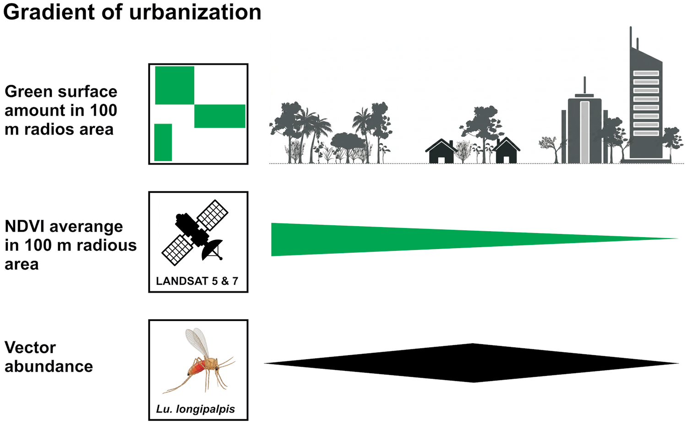

[PDF](https://doi.org/10.1093/jme/tjag112)

## Abstract

The urban expansion of *Lutzomyia longipalpis*, the principal vector of *Leishmania infantum* in the Americas, has created new epidemiological scenarios for visceral leishmaniasis, thereby increasing the need for early detection of vector colonization in cities. Most predictive approaches have focused on temporal dynamics driven by climate, whereas tools to prioritize surveillance sites within urban areas are still limited. Here, we developed and evaluated an environment-based strategy to identify critical intra-urban areas for early detection of *Lu. longipalpis*. We conducted a scoping review to identify environmental, social, and biotic variables most frequently associated with vector occurrence or abundance, prioritizing those suitable for operational use. Based on these findings, we constructed a consensus model using the normalized difference vegetation index (NDVI) as a proxy for environmental suitability. The model was parameterized with *Lu. longipalpis* abundance data from ten cities in northern Argentina, Brazil, and Paraguay, using spatio-temporal NDVI averages within 100-m buffers to classify urban areas into low-, intermediate-, and high-suitability categories. Model performance was evaluated using historical and independent field datasets. The model consistently identified urban areas associated with intermediate and high trap success, yielding high positive predictive values for these abundance classes, although performance was limited for predicting low abundance or absence. Our results indicate that NDVI-based suitability maps provide a simple, transferable framework to guide targeted *Lu. longipalpis* surveillance at the city scale. This approach supports cost-effective monitoring strategies and can contribute to earlier implementation of prevention and control actions for visceral leishmaniasis.

{fig-alt="Synthesis of the proposed top-down surveillance approach for *Lutzomyia longipalpis*. Environmental suitability is identified at the intra-urban scale using remotely sensed data, p" .featured-figure}

## Citation

M. G. Quintana, V. Andreo, R. Cavia, M. S. Santini, S. L. Moya, L. G. Estrada Méndez, et al. (2026). Environment-based strategy for monitoring early colonization of *Lutzomyia longipalpis* at the city scale. *Journal of Medical Entomology, 63(4), tjag112.*. <https://doi.org/10.1093/jme/tjag112>
