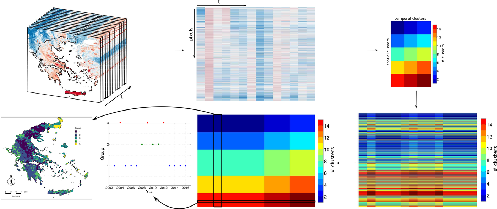

[PDF](https://doi.org/10.1109/IGARSS.2018.8519542)

## Abstract

This study presents the first results of the use of co-clustering to identify potential spatial and temporal concurrences of favourable conditions for the emergence and maintenance of West Nile Virus (WNV) in Greece. We applied the Bregman block average co-clustering algorithm with I-divergence to various time series (from 2003 to 2016) of indices derived from Land Surface Temperature (LST) reconstructed from MODIS products. The results show that the combination of two temporal and three spatial groups performs best in identifying times and areas with and without WNV human cases, yielding smaller standard deviations in co-clusters. Among the indices that appeared to perform better we found number of summer days, annual average of mean and maximum LST, potential number of mosquito and virus cycles (EIP) and mean LST of the WNV transmission season. These variables are consistent with known effects of temperature over mosquito development and reproduction as well as virus amplification. Further research will be carried out to identify groups of variables that cluster both in space and time.

{fig-alt="Identifying favorable spatio-temporal conditions for West Nile Virus outbreaks by co-clustering of MODIS LST indices time series" .featured-figure}

## Citation

V. Andreo, E. Izquierdo-Verdiguier, R. Zurita-Milla, R. Rosa, A. Rizzoli, A. Papa (2018). Identifying favorable spatio-temporal conditions for West Nile Virus outbreaks by co-clustering of MODIS LST indices time series. *2018 IEEE International Geoscience and Remote Sensing Symposium, pp. 4670--4673*. <https://doi.org/10.1109/IGARSS.2018.8519542>
